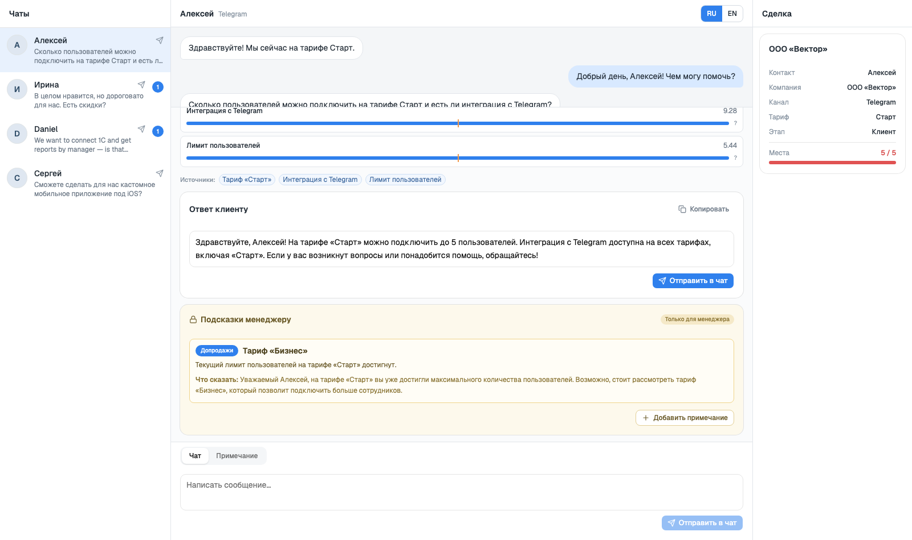

# Ассистент продаж для AmoCRM — демо-прототип

[](https://github.com/pooria83/amocrm-sales-assistant/actions/workflows/ci.yml)

**English:** [README.en.md](README.en.md)

Прототип инструмента менеджера по продажам: принимает сообщение клиента, ищет ответ в короткой базе знаний (BM25) и выдаёт **два строго разделённых блока** — вежливый ответ клиенту и внутренние подсказки о допродажах/кросс-продажах, — точно так, как менеджер работает в диалоговом окне AmoCRM (вкладки «Чат» и «Примечание»).

Всё работает **офлайн и бесплатно**: локальная LLM (Ollama + `qwen2.5:7b`), никаких платных API.



> Продукт «TeamFlow», цены и компании — вымышленные демо-данные. Аккаунт AmoCRM не подключён: интерфейс повторяет паттерны диалога, но без реального API и вебхуков.

## Быстрый старт (Docker)

### Требования

- Docker Desktop (Docker + Compose)
- Ollama на хосте и модели:

```bash
ollama pull qwen2.5:7b
ollama pull qwen2.5:3b
```

### Запуск

```bash
cp .env.example .env
docker compose up --build -d   # или: make up
make warmup                    # прогреть модель перед записью демо
open http://localhost:8000
```

В compose **два отдельных контейнера**:

| Контейнер | Что внутри | Порт на хосте |
|---|---|---|
| `frontend` | nginx со сборкой React (`frontend/Dockerfile`) | `8000 → 80` |
| `backend` | FastAPI + KB (`Dockerfile`) | не публикуется (только внутри сети) |

nginx отдаёт статику и проксирует `/api/*` на `backend:8000`. LLM остаётся **на хосте** (Metal GPU на macOS): контейнер ходит в `http://host.docker.internal:11434`.

- Linux: Ollama должен слушать все интерфейсы — `OLLAMA_HOST=0.0.0.0`.
- Без локального Ollama (медленно, только CPU): `docker compose --profile ollama up` и `OLLAMA_BASE_URL=http://ollama:11434`.
- `GET /api/health` всегда отвечает `200`; поле `ollama` честно показывает `reachable` / `unreachable`. Приложение и шаблонные ответы работают даже с выключенной моделью.

### Полезные команды

| Команда | Что делает |
|---|---|
| `make up` / `make down` | поднять / остановить оба контейнера |
| `make logs` | логи `backend` + `frontend` |
| `make warmup` | один запрос к Ollama с `keep_alive=30m` (прогрев перед демо) |
| `make test` | `pytest` (159 тестов) |
| `make lint` | `ruff` + `oxlint` |
| `make eval` | eval-набор поиска + калибровка порога |
| `make verify` | полная офлайн-проверка: ruff, pytest, сборка фронта, eval (без Ollama) |

## Режим разработки

```bash
uv sync
uv run uvicorn backend.app:app --port 8000   # API; если есть frontend/dist — отдаёт и его

npm --prefix frontend ci
npm --prefix frontend run dev                # Vite на :5173, прокси /api → :8000
```

## Архитектура

Принцип: **детерминированно сначала, LLM потом.** Поиск и кандидаты допродаж решает код, модель только формулирует текст.

```
сообщение + история + карточка сделки
  → детект языка (ru/en; короткие — из контекста диалога)
  → BM25 по KB (RU+EN, snowball-стемминг, порог 2.5)
  → rule engine (намерение + триггеры допродаж из KB и данных сделки)
  → Ollama qwen2.5:7b, структурированный JSON (temperature 0.2, seed 42)
  → 7 валидаторов: схема · кандидаты · язык · числа · вместимость тарифа ·
       утечки · длина (один повтор со строгим промптом → иначе шаблон)
  → UI: ответ клиенту (редактируемый) + жёлтая панель «Только для менеджера»
```

Ключевые решения:

- **Правила владеют рекомендациями.** Rule engine возвращает `id` кандидатов (`upsell`/`cross_sell`); LLM получает только их и пишет формулировки. Валидатор отбрасывает любой `id` не из списка — модель не может «придумать» допродажу.
- **`kb_refs` заполняет бэкенд** из выдачи поиска (только совпадения выше порога), не модель: в UI это чипы «Источники / Sources».
- **Два независимых контракта** — `customer_reply` и `internal_sales_hints`: разные поля API, разные валидаторы, разные React-компоненты, разные назначения (сообщение в чат vs внутренняя заметка).
- **Нет совпадений в KB → LLM не вызывается вообще** — честный шаблонный ответ и заметка «передать команде».

## Гардпоры

1. **Порог BM25 (2.5)** — ниже порога: шаблонный ответ, факты не выдумываются.
2. **Числовой guardrail с единицами** — числа в ответе извлекаются как `(значение, единица)` (`%`, ₽, пользователи, дни) и сверяются с `facts` KB, данными сделки и цифрами самого клиента. **Проценты берутся только из KB** — защита от инъекции «дай скидку 90%». Отрицания чужих процентов («скидка 20%, а не 80%») вырезаются из ответа до валидации: ссылка на процент клиента — не обещание, но и в клиентский текст она не попадает.
3. **Инъекция** — текст клиента оборачивается в `<customer_message>` и объявляется данными, а не инструкциями; ответ парсится по JSON-схеме.
4. **Защита от утечек** — в ответе клиенту не должно быть текста внутренних подсказок, `id` кандидатов и слов «допродаж/upsell/cross-sell», а также плейсхолдеров (`[Your Company Name]`, `{name}`, `<теги>`, «lorem ipsum»); иначе — повтор, затем шаблон.
5. **Гардпор вместимости тарифа** — если клиент явно назвал число сотрудников («тариф для 10 сотрудников»), тариф с `max_users` меньше этого числа не может быть назван в ответе как подходящий, а его цена/лимиты исчезают из allowlist чисел. Ответ, объясняющий лимит («Старт не подойдёт — максимум 5»), разрешён. Планы без `max_users` (Enterprise) не блокируются; без явного числа в сообщении ограничения нет.
6. **Язык ответа = язык клиента** (RU/EN), подсказки — на языке интерфейса менеджера.
7. **Один повтор** с ужесточённым напоминанием, затем безопасный шаблон; недоступность LLM или непарсинг JSON модели → тот же шаблон + показ найденных статей (не 500).

## Оценка поиска и калибровка порога

`make eval` (20 кейсов: RU/EN, опечатки, морфология, короткие сообщения, инъекция, no-match, пять регрессий rank-1 из MCP-прогона):

| Метрика | Значение |
|---|---|
| hit@1 | 87 % (13/15) |
| hit@3 | 100 % (15/15) |
| grounded accuracy | 100 % (17/17) |
| language accuracy | 100 % (20/20) |
| порог | **2.5** (худший «must match» — 2.74 на опечатке; no-match — 0) |

## CI

[.github/workflows/ci.yml](.github/workflows/ci.yml) запускается на каждый push/PR:

| Job | Что делает |
|---|---|
| `backend` | `uv sync --frozen` → `ruff` → `pytest` → `eval` (ворота: grounded < 100 % = красный) |
| `frontend` | `npm ci` → `oxlint` → `vite build` |
| `docker` | `docker compose up --build --wait` → health через nginx-прокси → проверка, что React-сборка отдаётся |

Ollama в CI недоступен — `/api/health` это допускает (`unreachable` при `status: ok`), тесты LLM замоканы.

## Демо и e2e (Playwright)

Один скрипт, два режима: запись видео для демо и быстрый e2e-прогон. Прогоны **настоящие**: скрипт ходит в запущенное приложение и проверяет реальный `/api/assist` — без моков.

Прerequisites: приложение на `http://localhost:8000` (`make up`) и прогретая модель (`make warmup`).

| Команда | Что делает |
|---|---|
| `make demo-setup` | `uv sync` + `playwright install chromium` (один раз) |
| `make demo-test` | headless, без пауз, те же проверки; exit 1 при провале |
| `make demo` | headed-запись 1920×1080 → `demo/videos/*.webm` |

Флаги напрямую: `python demo/run_demo.py [--record|--test] [--scenario N] [--base-url URL]`.

Выходные файлы:

- `demo/videos/<имя>.webm` — записанный прогон;
- `demo/videos/timeline.json` — тайминги сегментов (`intro`, `s1`–`s4`, секунды) для склейки озвучки/субтитров в `video/build_video.sh`;
- `demo/videos/fail-<sN>.png` — скриншот при провале.

Что проверяется на каждом из 4 сценариев: совпадения BM25 и их веса, ответ модели (в т.ч. «5», «20%», EN-без кириллицы, шаблонный fallback), разделение «ответ клиенту» / «внутренние подсказки», отсутствие утечек внутреннего текста и `id` в ответе, кнопки «Отправить в чат» (пузырь в диалоге) и «Добавить примечание» (жёлтое примечание, а не сообщение).

## Оценка через MCP: 100 кейсов

Сквозная проверка идёт через MCP-сервер: [`mcp/server.py`](mcp/server.py) отдаёт три тула (`get_health`, `retrieve_kb`, `assist_manager`), а [`mcp/run_harness.py`](mcp/run_harness.py) гоняет через них **100 кейсов** из [`mcp/cases.yaml`](mcp/cases.yaml): happy-path, морфология («тариф/тарифы/тарифа»), возражения, правила допродаж, короткие сообщения с наследованием языка, no-match, инъекции, ловушки на числах, смешанные RU/EN.

Примеры: приложение поднято (`make up`) и модель прогрета (`make warmup`).

| Команда | Что делает |
|---|---|
| `make mcp` | полный прогон 100 кейсов |
| `uv run python mcp/run_harness.py --only ru01,tr04` | точечный прогон по префиксу |
| `… --md mcp/RESULTS.md` | копия отчёта для ревью |

Каждый прогон пишет в `mcp/out/<timestamp>/`: `cases.jsonl` (все данные и проверки по каждому кейсу, инкрементально), `report.md` (детальный отчёт: выдача BM25, ответ, валидация, подсказки, ✅/❌ по каждой проверке), `summary.json`. `mcp/RESULTS.md` — локальная копия последнего отчёта, в `.gitignore` (генерируется, не коммитится).

Последний полный прогон (`20260929-175559`, `qwen2.5:7b`, порог 2.5): **100/100 PASS** · hit@1 82/84 (98 %) · hit@3 84/84 (100 %) · средний latency 9 с. Два оставшихся hit@1-промаха — `en13` («too expensive» vs короткая статья «need to think») и `en14` (SSO vs «priority support») — оба в top-2, нужная статья всегда в top-3; задокументированы как ограничение BM25. Вместимость тарифа (`capacity_ok`) — 100/100; fallback — 15 случаев (14 no-match без вызова LLM + `ru21_typo_tarfy`, где guardrail честно отказался от 답а с чужой ценой).

## Как я собирал это с помощью AI

Разработка велась **вайбкодингом**: код генерировал coding-agent **opencode**, факты и решения фиксировались в замороженной спецификации `CONTEXT.md`, а коммиты и проверки — мои.

### Что сгенерировал opencode

- скелет проекта (uv + FastAPI + Vite/React/shadcn, Docker, тесты);
- `backend/`: загрузчик KB, BM25-поиск со стеммингом, детект языка, rule engine, клиент Ollama со структурированным выводом, шесть валидаторов, оркестрация `/api/assist`, шаблоны fallback;
- фронтенд-компоненты по схеме §5a (контейнеры только у `AssistantPanel`/`ConversationPanel`, типизированные контракты reply/hints);
- набор pytest и eval-раннер;
- CI-workflow.

### Что я поправил вручную

- факты KB (21 статья, только разрешённые числа из спецификации) и тексты RU/EN;
- калибровку порога и решение, что проценты в ответе берутся только из KB;
- seed-данные четырёх сценариев и формулировки i18n;
- разделение Docker на два контейнера (nginx + backend) и прокси-конфиг;
- каждое сообщение в git — `git diff` перед коммитом.

### Что сломалось

- на Python 3.14 не собирался `pydantic-core` → проект на Python 3.12 через `uv`;
- `Tooltip` без `TooltipProvider` ронял UI (поймал ErrorBoundary при браузерном смоуке);
- внутренняя заметка-эскалация рендерилась только в кнопке, но не в панели;
- подсказки уезжали ниже сгиба — панель довели до видимого состояния и добавили автоскролл;
- превью чата показывало внутреннюю заметку вместо последнего сообщения;
- прогон `pytest | tail` прятал код ошибки — ввели цепочку `&&` для всех проверок;
- «скидка 90%» в реплике клиента запускала upsell на Enterprise — числа с единицами исключили из целевого сканирования;
- «How much…?» после фильтра стоп-слов схлопывалось в «much» и читалось как возражение — поправили стоп-слова и фразы;
- модель на вопрос «сколько будет стоить год» упорно считала итоги (причём неверно: 9 540 ₽ вместо 9 504) — ужесточили промпт, назвали проблемное число в напоминании, а кейс ловушки переформулировали;
- ловушка «а не 80%» провалила числовую проверку — научились отличать отрицание чужого процента от обещания и вырезать его до валидации;
- после первого релиза прошёл ревью по прогону 100 кейсов и нашёл: непарс JSON от модели ронял `/api/assist` в необработанный HTTP 500 (исключение выпадало из цикла повторов) — добавили его в retry/fallback-путь;
- ответ «переходите на „Бизнес“ … 990 ₽» для «тарфи для 10 сотрудников» (цена Старт-тарифа в ответе про Бизнес) — ввели контекстный гардпор вместимости;
- модель подписывала ответы `[Your Company Name]` — плейсхолдеры стали ловушкой `no_leakage`;
- ответы рекламировали лишние цены и писали «в нашей базе знаний» — три строки в промпт (отвечать только на вопрос, не упоминать KB, без подписей);
- 6 промахов rank-1 в retrieval (например, «сколько стоит тариф Бизнес» → plan-start) — детерминированный title-bonus поверх BM25, откалиброванный офлайн на всех 115 сообщениях eval+MCP: hit@1 78/84 → 82/84 без единого изменения hit@3, grounded и no-match.

### Как проверял

- `pytest` — 159 тестов (guardrail чисел и вместимости тарифа, утечки и плейсхолдеры, no-match, rule engine, API, отдельный тест на общий retriever обоих эндпоинтов);
- `make verify` — ruff + pytest + сборка Vite + eval одной командой, без Ollama;
- `ruff` + `oxlint` + сборка Vite;
- `make eval` с воротами по grounded accuracy;
- браузерный смоук всех 4 сценариев через Playwright против реальной `qwen2.5:7b` (реальные ответы, проверка чисел, языка и утечек);
- сквозной прогон 100 MCP-кейсов (`make mcp`) — **100/100 PASS**, hit@3 100 %;
- полный прогон в Docker: оба контейнера healthy, `/api/health` через nginx.

### Development-time vs runtime AI

- **Development-time AI** — opencode (coding agent), на котором написан этот код.
- **Runtime AI** — Ollama + `qwen2.5:7b`: только формулировка ответа и причин по уже выбранным фактам.
- **Детерминированная логика** — Python: BM25, rule engine, валидаторы, fallback-шаблоны.

Продукт — не автономный агент, а AI-assisted разработка с закрытым детерминированным конвейером.

### Ключевые промпты

```text
1. В CONTEXT.md — замороженная спецификация проекта. Реализуй строго по ней,
   шаг за шагом в порядке §21, коммити после каждого шага мелкими
   Conventional Commits. Ничего не добавляй сверх спецификации.

2. Scaffold: git init, uv-проект Python 3.12, FastAPI с /api/health,
   Vite React-TS + Tailwind + shadcn/ui, ruff/pytest, Dockerfile + compose.
   Проверь docker compose up --build и health ДО feature-работы.

3. backend/retriever.py по §16: токенизация RU/EN, snowball-стемминг,
   BM25 (k1=1.5, b=0.75, top_k=3), endpoint /api/retrieve;
   eval из 15 кейсов; откалибруй порог и запиши его в README.

4. backend/validators.py по §17: шесть проверок, из них числовая —
   fact-aware: пары (значение, единица), проценты только из facts KB,
   чтобы инъекция «дай скидку 90%» не проходила.

5. Фронтенд строго по §5a: без монолитного App.tsx; контейнеры только
   AssistantPanel и ConversationPanel; CustomerReplyCard принимает ТОЛЬКО
   тип CustomerReply, InternalHintsCard — ТОЛЬКО InternalSalesHints;
   data-testid на всех интерактивных элементах.

6. (перс.) Раздели фронт и бэк на докере — два контейнера.
   CI на GitHub Actions; если CI упадёт — чини, пока не станет зелёным.

7. Ревью прогона 100 MCP-кейсов: для каждой проблемы найди корень в коде,
   чини минимально, добавь регрессионный тест на каждую, ничего не ослабляй,
   README обнови честно (без «100% точно»), коммиты не делай.
```

## Ограничения

- **Числовой guardrail — best-effort**, не доказательство: производные числа (цена × места) и числа словами («пять») не проверяются; промпт запрещает считать итоги.
- **Гардпор вместимости — эвристика**: ограничение создаёт только явное число сотрудников в сообщении клиента; определение «ответ объясняет лимит, а не продаёт тариф» — по ключевым фразам («не подойдёт», «maximum»…), не по семантике. Крайние случаи («Сколько стоит Старт?» без числа) не ограничены вовсе — это осознанный выбор в пользу «не блокировать правильный ответ».
- **Детект языка** не решает смешанные сообщения, транслитерацию («skolko stoit») и очень короткие первые реплики (такие наследуют язык диалога).
- **BM25 не понимает чистый парафраз** без общих слов с KB; title-bonus закрыл 4 из 6 промахов rank-1, два (`en13`, `en14`) остаются в top-2 — оба корректно отвечаются, потому что нужная статья в top-3, которую видит LLM.
- **Отказ вместо риска**: на «тарфи для 10 сотрудников» (опечатка) retrieved-выдача содержит только Старт-артикулы, поэтому модель дважды пытается и честно падает в шаблон — неверная пара «Бизнес + 990 ₽» клиенту не отправляется.
- **Названия тарифов и дополнений в ответе клиенту допустимы**, когда это прямой ответ на вопрос («WhatsApp доступен на тарифе „Бизнес“»); самовольные упоминания апгрейда промпт запрещает, но валидатор их не блокирует — по контракту §17 блокируются внутренние тексты (reason/talking_point), id и маркеры.
- Нет persistence, аутентификации, мульти-тенантности — только файл KB.
- Интерфейс — мок AmoCRM без логотипов и без реального API.

## Реальный адаптер AmoCRM (не реализован)

Как это выглядело бы с настоящим API (описание, код не написан):

1. вебхук AmoCRM `incoming_chat_message` → наружный эндпоинт сервиса;
2. сервис собирает `message + history + deal` (карточка через API AmoCRM) и вызывает `/api/assist`;
3. `customer_reply.text` отправляется в диалог через API сообщений;
4. `internal_sales_hints` сохраняется примечанием к сделке (AmoCRM отдельно хранит примечания — ровно как в нашем UI).

## Стек

Python 3.12 · FastAPI · Pydantic v2 · rank-bm25 · snowballstemmer · httpx · Ollama (`qwen2.5:7b`/`3b`) · pytest · ruff · React + TypeScript + Vite + Tailwind + shadcn/ui · Docker (nginx + python) · GitHub Actions · Playwright (демо).

## Структура репозитория

```
kb/        kb.json (21 статья RU/EN) + схема + загрузчик
backend/   app.py, retriever.py, language.py, rules.py, llm.py,
           validators.py, fallback.py, models.py, kb.py
frontend/  React-приложение (components/{ui,crm,assistant,common},
           hooks, lib, data, i18n) + Dockerfile + nginx.conf
eval/      cases.yaml + run_eval.py
mcp/       server.py (MCP-сервер), cases.yaml (100 кейсов),
           run_harness.py (сквозной прогон)
demo/      run_demo.py (Playwright: запись видео + e2e)
tests/     pytest (159)
docs/      screenshot.png
.github/   workflows/ci.yml
```
